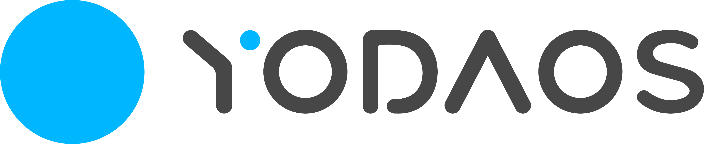

<p align="center">
  
</p>

<p align="center">
  
  
</p>

This is a modern operating system for next generation interactive device, and it embraces Web community,
uses JavaScript as the application language.

## Get Started

To start with [YodaOS][], a Linux or MacOS is required to build the image.

For Ubuntu:

```sh
$ apt-get install build-essential subversion libncurses5-dev zlib1g-dev gawk gcc-multilib flex git-core gettext libssl-dev unzip texinfo device-tree-compiler dosfstools libusb-1.0-0-dev
```

For MacOS, you need to install some GNU tools which the openwrt is required:

```sh
$ brew install gnu-tar gnu-getopt findutils m4
```

> Linux source tree requires a case-sensitive file system, make sure your workspace is APFS (case-sensitive) before you start.

The openwrt [check gnu-getopt version](./openwrt/include/prereq-build.mk) via the `gnugetopt` command name, so the following link is also required:

```sh
$ ln -sf $(brew list gnu-getopt | grep bin) /usr/local/bin/gnugetopt
```

### Download Source

```shell
$ git clone git@github.com:yodaos-project/yodaos.git
```

### Build

```sh
$ ./configure -p rpi -c rpi3b_plus
$ make -C openwrt # build under the openwrt directory
```

The `configure` command is to select which board that you were to build:

| board             | product       |
|-------------------|---------------|
| Raspberry 3b plus | [raspberry][] |
| Kamino18          | [kamino18][]  |

Go [compile & run](https://yodaos-project.github.io/yoda-book/en-us/yodaos-source/system/compile-run.html) for more details.

## Community

- [YouTube](https://www.youtube.com/channel/UCRvBWIaBcsfvCTC_4EKW4lw)

## Contributing

[YodaOS][] is a community-driven project that we accepts any improved proposals, pull requests and issues.

- For JavaScript development, go [yodart][] for details.
- For proposal, [yodaos-project/evolution][] is the place where someone can submit pull request to propose something.

## Documentation

- [YodaOS Book](https://github.com/yodaos-project/yoda-book)

## License

Apache 2.0

[YodaOS]: https://github.com/yodaos-project
[yoda.js]: https://github.com/yodaos-project/yoda.js
[flora]: https://github.com/yodaos-project/flora
[yodaos-project/evolution]: https://github.com/yodaos-project/evolution
[Semver 2.0]: https://semver.org/
[ShadowNode]: https://github.com/yodaos-project/ShadowNode
[Node.js]: https://github.com/nodejs/node
[raspberry]: ./products/rpi
[kamino18]: ./products/k18

